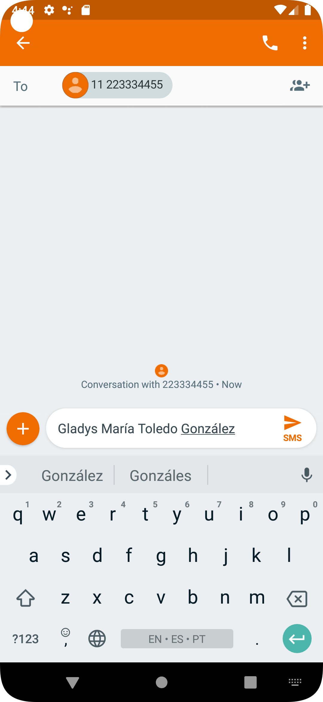

# CursoAndroidAula05
 Solução dos desafios da aula 05 à aula 09 do curso

## fragment_login screenshot:
   

## fragment_details screenshot:
### Passing data between fragments:
   

## share_view screenshot:
### Sharing "Name" property to other apps:
   

## message_app screenshot:
### Showing shared "Name" property in Message app:
   

## text_message_to_share screenshot:
### Selecting text message to share with CursoAndroidAula05 app:
   

## curso_android_aula05_app screenshot:
### Showing shared text message in CursoAndroidAula05 app:
   